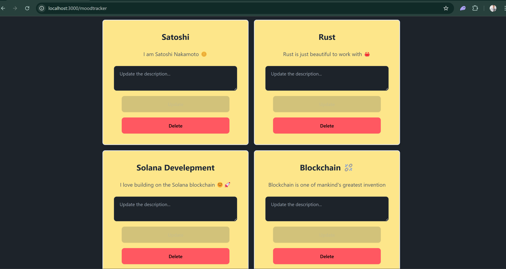

# MoodTracker

## Overview

MoodTracker is a decentralized application (dApp) that allows users to securely log, update, and manage their moods on-chain using the Solana blockchain. The application leverages the Anchor framework for Solana program development and Nextjs for the front-end interface.

---


---



## Getting Started

### Prerequisites

Ensure you have the following installed:

- **Node.js**: v18.18.0 or higher
- **Rust**: v1.77.2 or higher
- **Anchor CLI**: v0.30.1 or higher
- **Solana CLI**: v1.18.17 or higher

---

### Installation

#### Clone the Repository

```shell
git clone <repo-url>
cd <repo-name>
```

#### Install Dependencies

```shell
pnpm install
```

#### Start the web app

```
pnpm dev
```

## Apps

### anchor

This is a Solana program written in Rust using the Anchor framework.

#### Commands

You can use any normal anchor commands. Either move to the `anchor` directory and run the `anchor` command or prefix the command with `pnpm`, eg: `pnpm anchor`.

#### Sync the program id:

Running this command will create a new keypair in the `anchor/target/deploy` directory and save the address to the Anchor config file and update the `declare_id!` macro in the `./src/lib.rs` file of the program.

You will manually need to update the constant in `anchor/lib/counter-exports.ts` to match the new program id.

```shell
pnpm anchor keys sync
```

#### Build the program:

```shell
pnpm anchor-build
```

#### Start the test validator with the program deployed:

```shell
pnpm anchor-localnet
```

#### Run the tests

```shell
pnpm anchor-test
```

#### Deploy to Devnet

```shell
pnpm anchor deploy --provider.cluster devnet
```

### web

This is a React app that uses the Anchor generated client to interact with the Solana program.

#### Commands

Start the web app

```shell
pnpm dev
```

Build the web app

```shell
pnpm build
```
